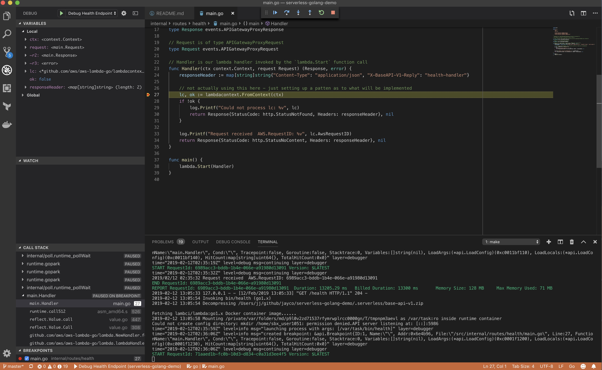

# serverless-golang-demo
Simple base api demo for AWS lambda in golang

## Prerequisites

- [serverless](https://serverless.com/) installed locally
- [golang](https://golang.org/) installed locally
- [delve](https://github.com/go-delve/delve) installed locally
- [docker](https://www.docker.com/) running locally
- [SAM CLI](https://github.com/awslabs/aws-sam-cli) installed locally
- [AWS account](https://portal.aws.amazon.com/billing/signup#/start) hosted domain, SSL certificate for domain `*.yourdomain.com`, IAM permissions for deployment etc...


## Reasoning
This is a demo that could be the base of a serverless api, it contains a health endpoint that returns an empty `StatusNoContent`. It serves as a starter to attach other routes and build out self contained api logic.

This service will create the following AWS infrastructure:
- api health endpoint
- a base path in the form of an environment `/dev/` or `/prod/`
- a route53 A record for `testing-subdomain.yourdomain.com`
- secure route via HTTPS through AWS ACM

## Configuration

The api is created and deployed via the `serverless.yml` file. The configuration utilises two plugins:

```yaml
plugins:
  - serverless-sam
  - serverless-domain-manager
```

- [serverless-sam](https://github.com/sapessi/serverless-sam) for converting severless.yml to SAM-CLI template for local debugging
- [serverless-domain-manager](https://github.com/amplify-education/serverless-domain-manager) for attaching the custom domain to the api endpoint

The api has exported endpoints that can then be cross referenced with different api components i.e users api, billing api, doc api etc...

**Example**: The api id will be available to import in other apis

```yaml
resources:
  Outputs:
    BaseApiV1Id:
      Value:
        Ref: ApiGatewayRestApi
      Export:
        Name: ${self:custom.stage}-BaseApiV1Id

    BaseApiV1RootId:
      Value:
        Fn::GetAtt:
          - ApiGatewayRestApi
          - RootResourceId
      Export:
        Name: ${self:custom.stage}-BaseApiV1RootId
```

## Local development

### Adding routes

Routes can be added by adding handler functions in the `internal/routes` folder.
Routes should be placed in their own directory and then the handler method added to the `Makefile` build for exec files that can be debugged and tested locally.

**Example**: Building a debug exec in the makefile:

```Makefile
	@echo "Building health route"
	@docker run \
	-e "GO111MODULE=on" \
	-e "CGO_ENABLED=1" \
	-e "GOARCH=amd64" \
	-e "GOOS=linux" \
	-v $(PWD):/src \
	-w /src/ lambci/lambda:build-go1.x \
	go build -gcflags='-N -l' -o bin/health internal/routes/health/main.go
```

### Local debugging

You can run and debug locally using the SAM-CLI. Ensure you have all the prerequisites installed and running locally.

There is a **.vscode** folder included in the repo, the settings are relative to the repo so it should work in vscode 
without any additional setup.

`launch.json`

```json
{
  "version": "0.2.0",
  "configurations": [
    {
      "name": "Debug Health Endpoint",
      "type": "go",
      "request": "launch",
      "mode": "remote",
      "remotePath": "/src/internal/routes/health/main.go",
      "port": 5986,
      "host": "127.0.0.1",
      "program": "${workspaceRoot}/internal/routes/health/main.go",
      "env": {},
      "args": [],
      "trace": "verbose"
    },
  ]
}
```

`settings.json`:

```json
{
    "go.delveConfig": {
        "apiVersion": 1
    }
}
```

**Note**: If the remote path is not set correctly then the break points will fail silently.

Install npm packages for serverless:
```bash
$ npm i
```

Set a break point in main.go and Run the debugging command:
```bash
$ make local-debug
```

Hit the endpoint from another terminal:
```bash
$ curl localhost:3000/health
```

Run the vscode debugger **Once** the lambda function has executed.
**Note** initial startup time can be delayed due to the docker image being downloaded.

You should be able step through the lambda function and debug as you would any local golang program:



Running Tests

Given the integration test is (more of an example) something you may 
not wish to run in your CI, the tests are split into both unit and integration test commands.

**Note**: The integration tests run locally using the SAM-CLI and need to be built with the debugging flags.

```
$ make test-unit
$ make test-integration
```
 Credit to [smalleats](https://github.com/smalleats/serverless-todo-example) for the integration testing idea.

## Deployment

### Locally

**Note**: Ensure you have your [AWS credentials](https://docs.aws.amazon.com/cli/latest/userguide/cli-chap-configure.html) set up and configured locally. You will need to have configured IAM roles and permissions.

Deployment is a two step process:

  1 - create the domain using the serverless `serverless create_domain --stage dev`

  2 - Deploy the service using the `serverless deploy --stage dev`

It can take up to 40 min for new domain to be ready.

You should then be able to hit `https://api-v1.yourdomain.com/dev/health`:

```
$ curl -i https://api-v1.yourdomain.com/dev/health
HTTP/2 204 
...
```

### CI deployment

You can use a number of different CI's as its all pretty straight forward to compile from already existing make commands. Serverless's own [Seed CI](https://seed.run) will create all the build steps
from the `serverless.yml`. It will use the default build command in the Makefile and it only requires you link your github/bitbucket/gitlab account and will run without any 
configuration.

There is a `seed.yml` in the root dir. This is used for any extra build steps that you may need. For this service we run a pre-deploy build step to create the domain. Seed will automatically add `dev` and `prod` env vars to determine which stage is being deployed.

## Cleaning up

To remove any resources when you are finished just use serverless from the terminal to destroy the created stack:

```bash
# Remove the domain
$ serverless delete_domain

# remove the remaining infrastructure
$ serverless remove
```
